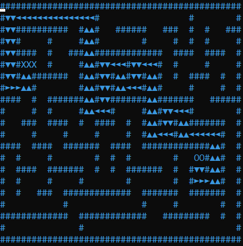

# Sabanci University CS300 Data Structures - Path Writer for HW1

Visualizes path of the solution that was created by HW1 maze generator and solver code.
Result is printed to a file called solution.txt.

### An Example 

